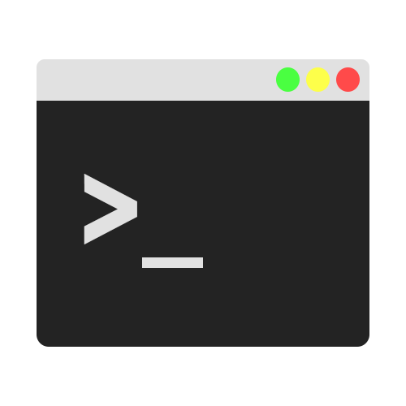
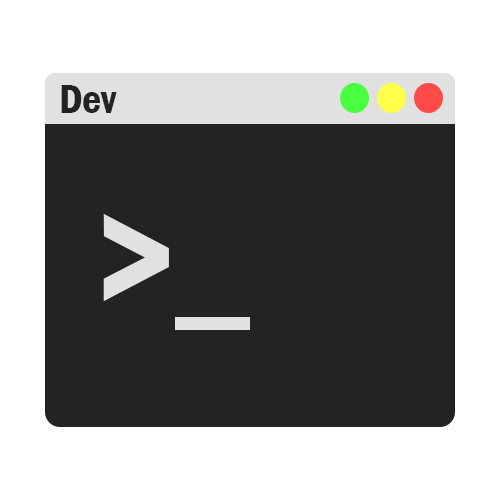
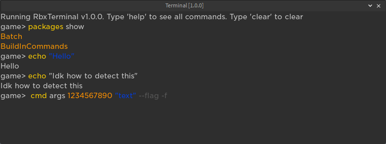
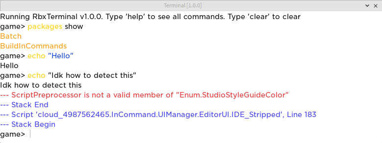

# RbxTerminal

RbxTerminal is the new and improved version of [CMD](https://devforum.roblox.com/t/cmd-a-simple-windows-like-cmd/2024427)!

But not like CMD this is really like Commandprompt

+It has a [TestEZ](https://roblox.github.io/testez/) Command!

## How does it look like??

<details>
  <summary>Logo</summary>

  

  
</details>

<details>
  <summary>Dark</summary>

  
</details>

<details>
  <summary>Light</summary>

  

  ***wierd InCommand error***
</details>

You may see that the output will also be displayed on the Terminal.
To disable this run: ```settings set logMessagesEnabled false```

## Installation

You can download it on [Roblox](https://www.roblox.com/library/12004274656/) for 100 Robux

or for free on [Github](https://github.com/Command17/RbxTerminal)!

<details>
  <summary>Guide for Github</summary>
  
    If your on the Github page go to release and find the most resent.
    Click on it and download the RbxTerminal.rbxm

    Drag and drop it into Roblox Studio. Right Click on it and Click save as local plugin and your done!
</details>

## Commands

I will not explain what every command does exactly.

<details>
  <summary>packages</summary>

```version packageName: string``` this will say what version a package is on

```install dir: Directory``` this will install a ModuleScript (dir) as package

```uninstall packageName: string``` this will uninstall a package

```show --version | -v``` this will show every package installed. The ```--version``` flag will also show the version
</details>

<details>
  <summary>testez</summary>

```test dir: Directory``` this will test a ModuleScript.spec (dir) with [TestEZ](https://roblox.github.io/testez/)

</details>

<details>
  <summary>settings</summary>

```set setting: string, bool: boolean``` this will set a setting to true or false

```get setting: string``` this will show the value of a setting

</details>

---

```run dir: Directory``` this will run a ModuleScript.bat (dir).

```cd dir: Directory, .., _``` this will set the current dir.

```echo text: string --r, --b, --o, --y, --p, --g``` prints something in the terminal.

## Packages

So here's how a package is build:

```lua
return {
    Name = "PackageName", -- Name for the package
    Version = "0.1.0", -- Version for the package

    ["command1"] = function(args, flags, terminal) -- Command without subcommands | Args and Flags are an Array. Terminal is the Terminal
        terminal:CreateMessage("Some Text", "Blue") -- Blue, Purple, Red, Yellow, Green
    end,

    ["command2"] = { -- Command with subcommands :flushed:
        ["sub"] = function(args, flags, terminal)
            terminal:CreateMessage("Sup bro", "Purple")
        end,

        ["sub2"] = function(args, flags, terminal)
            terminal:CreateMessage("Sup bro v2", "Green")
        end,
    end,
    }
}
```

## A .bat Module

A bat Module is a ModuleScript that returns a function and ends with .bat

It's build like this:

```lua
return function(terminal) -- the Terminal

end
```

## API

### Create Message

Creates a message in the terminal.

Colors:
Red, Blue, Purple, Yellow, Green, Orange

any other Color will be Default

```lua
terminal:CreateMessage(Text: string, Color: string?)
```

### GetSetting and SetSetting

Allows you to save bools or change settings in the plugin.

```lua
terminal:SetSetting(setting: string, value: boolean)
```

```lua
local v = terminal:GetSetting(setting: string)
```

### Dir functions

SetDirWithString will set the dir with a string (```game/Workspace/Baseplate```)

```lua
terminal:SetDirWithString(dir: string) -- Example: game/Workspace/Baseplate
```

GetDirInDirWithString will return an Instance in the current dir with a string

```lua
terminal:GetDirInDirWithString(dir: string) -- Example: Workspace/Baseplate (The current dir is game)
```

DirToString will return a string(```game/Workspace```) from the current dir

```lua
local Dir = terminal:DirToString()
```

terminal.Dir is the Instance of the current dir

```lua
local dir = terminal.Dir
```

### Plugin

You can get the plugin with ```terminal.plugin```

### Credits

<details>
  <summary>Open</summary>

  [Promise](https://eryn.io/roblox-lua-promise/docs/intro) by eveara

  [Roact Hooks](https://github.com/Kampfkarren/roact-hooks) by kampfkarren

  [Studio Plugin](https://github.com/csqrl/studio-plugin) by csqrl

  [Studio Theme](https://github.com/csqrl/studio-theme) by csqrl

  [Roact](https://roblox.github.io/roact/) by roblox

  [Rodux](https://roblox.github.io/rodux/) by roblox

  [Rodux Hooks](https://github.com/solarhorizon/rodux-hooks) by SolarHorizon

  [Stift](https://github.com/csqrl/sift) by csqrl

  [TestEZ](https://roblox.github.io/testez/) by roblox

  And you!

</details>